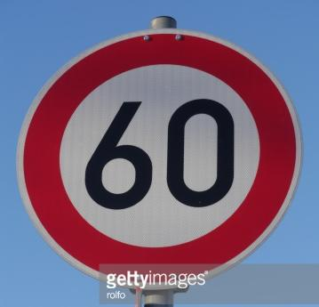
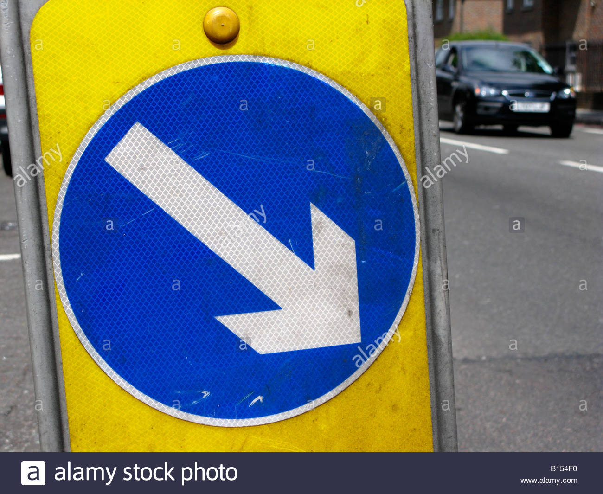
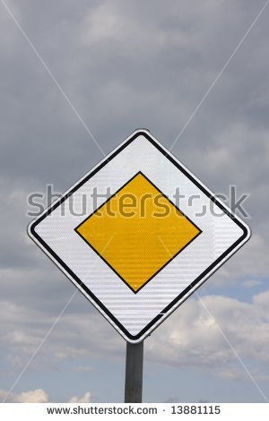
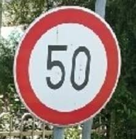

# **Traffic Sign Recognition**

## Writeup

### You can use this file as a template for your writeup if you want to submit it as a markdown file, but feel free to use some other method and submit a pdf if you prefer.

---

**Build a Traffic Sign Recognition Project**

The goals / steps of this project are the following:
* Load the data set (see below for links to the project data set)
* Explore, summarize and visualize the data set
* Design, train and test a model architecture
* Use the model to make predictions on new images
* Analyze the softmax probabilities of the new images
* Summarize the results with a written report

## Rubric Points
### Here I will consider the [rubric points](https://review.udacity.com/#!/rubrics/481/view) individually and describe how I addressed each point in my implementation.  

---
### Writeup / README

#### 1. Provide a Writeup / README that includes all the rubric points and how you addressed each one. You can submit your writeup as markdown or pdf. You can use this template as a guide for writing the report. The submission includes the project code.

You're reading it! and here is a link to my [project code](https://github.com/Mahmoud-Selim/CarND-Traffic-Sign-Classifier-Project/blob/master/Traffic_Sign_Classifier.ipynb)

### Data Set Summary & Exploration

#### 1. Provide a basic summary of the data set. In the code, the analysis should be done using python, numpy and/or pandas methods rather than hardcoding results manually.

I used the numpy library to calculate summary statistics of the traffic
signs data set:

* The size of training set is ?
* The size of the validation set is ?
* The size of test set is ?
* The shape of a traffic sign image is ?
* The number of unique classes/labels in the data set is ?

#### 2. Include an exploratory visualization of the dataset.

Here is an exploratory visualization of the data set. It is a bar chart showing how the data ...

![alt text][./statistics/statistics.png]

### Design and Test a Model Architecture

#### 1. Describe how you preprocessed the image data. What techniques were chosen and why did you choose these techniques? Consider including images showing the output of each preprocessing technique. Pre-processing refers to techniques such as converting to grayscale, normalization, etc. (OPTIONAL: As described in the "Stand Out Suggestions" part of the rubric, if you generated additional data for training, describe why you decided to generate additional data, how you generated the data, and provide example images of the additional data. Then describe the characteristics of the augmented training set like number of images in the set, number of images for each class, etc.)

I decided to normalize my training data. I didn't convert it to grayscale as i thought that some colors will be beneficial to consider as features. This is because traffic signs have spicific colors

#### 2. Describe what your final model architecture looks like including model type, layers, layer sizes, connectivity, etc.) Consider including a diagram and/or table describing the final model.

My final model consisted of the following layers:

| Layer         		|     Description	        					|
|:---------------------:|:---------------------------------------------:|
| Input         		| 32x32x3 RGB image   							|
| Convolution 5x5    	| 1x1 stride, same padding, outputs 28x28x12	|
| RELU					|												|
| Max pooling	      	| 2x2 stride,  outputs 14x14x12			    	|
| Convolution 5x5    	| 1x1 stride, same padding, outputs 10x10x16	|
| RELU					|												|
| Max pooling	      	| 2x2 stride,  outputs 5x5x16	        		|
| Fully connected		| 3 layers fully connected network with dropout |
| Softmax				| softmax to get the logits                     |

#### 3. Describe how you trained your model. The discussion can include the type of optimizer, the batch size, number of epochs and any hyperparameters such as learning rate.

To train the model, I used Adam optimiser as my optimising technique. I used a 128 batch size with  epochs. I initialized my parameters with mean equals zero and 0.1 variance. I used .001 learning rate and i trained my model.

#### 4. Describe the approach taken for finding a solution and getting the validation set accuracy to be at least 0.93. Include in the discussion the results on the training, validation and test sets and where in the code these were calculated. Your approach may have been an iterative process, in which case, outline the steps you took to get to the final solution and why you chose those steps. Perhaps your solution involved an already well known implementation or architecture. In this case, discuss why you think the architecture is suitable for the current problem.

My final model results were:
* training set accuracy of 0.997
* validation set accuracy of 0.956
* test set accuracy of 0.921

If an iterative approach was chosen:
* What was the first architecture that was tried and why was it chosen?
At first, i used the LeNet architecture so that i could get an insight on the training. I also converted to grayscale but discarded it later.
* What were some problems with the initial architecture?
It didn't get past .9 for the validation acuuracy so i tweaked it.
* How was the architecture adjusted and why was it adjusted? Typical adjustments could include choosing a different model architecture, adding or taking away layers (pooling, dropout, convolution, etc), using an activation function or changing the activation function. One common justification for adjusting an architecture would be due to overfitting or underfitting. A high accuracy on the training set but low accuracy on the validation set indicates over fitting; a low accuracy on both sets indicates under fitting.
I discarded the grayscale and it got a better accuracy. I normalized the features and i increased the filter size on the first two convolutions. I increased the number of epochs and it worked
* Which parameters were tuned? How were they adjusted and why?
learning rate, epochs and the sigma(Variance) for intializing the weights and biases. the learning rate was reduced to prevent convergence of the model. I increased the epochs to get a better model accuracy. and the sigma helped at the initial epoch accuracy
* What are some of the important design choices and why were they chosen? For example, why might a convolution layer work well with this problem? How might a dropout layer help with creating a successful model?
I think that converting back to RGB really helped. Also, a convolutions helped because normally convolutions and shared parameters help with the images classification. Dropouts helped with the overfitting and it made the predictions morerobust.

### Test a Model on New Images

#### 1. Choose five German traffic signs found on the web and provide them in the report. For each image, discuss what quality or qualities might be difficult to classify.

Here are five German traffic signs that I found on the web:

The images were only of different dimensions but i converted them to 32x32x3 images to be suitable for the network.

#### 2. Discuss the model's predictions on these new traffic signs and compare the results to predicting on the test set. At a minimum, discuss what the predictions were, the accuracy on these new predictions, and compare the accuracy to the accuracy on the test set (OPTIONAL: Discuss the results in more detail as described in the "Stand Out Suggestions" part of the rubric).

Here are the results of the prediction:

| Image			        |     Prediction	        					|
|:---------------------:|:---------------------------------------------:|
| No entry      		| No entry   									|
| Speed limit: 60km/hr	| Speed limit: 60km/hr 							|
| Keep right			| Keep right									|
| Priority road      	| Priority road  								|
| Turn right ahead	   	| Turn right ahead					 			|
| Speed limit: 50km/hr	| Speed limit: 50km/hr     						|

The model was able to correctly guess 5 of the 5 traffic signs, which gives an accuracy of 10%. This compares favorably to the accuracy on the test set of 0.921

#### 3. Describe how certain the model is when predicting on each of the five new images by looking at the softmax probabilities for each prediction. Provide the top 5 softmax probabilities for each image along with the sign type of each probability. (OPTIONAL: as described in the "Stand Out Suggestions" part of the rubric, visualizations can also be provided such as bar charts)

The code for making predictions on my final model is located in the 15th cell of the Ipython notebook.

The model was quite confident of the classfied images. the probabilities of other classes were almost zero, so, i'll just mention the probabilities of the classified images that they belong to the correct class

| Probability         	|     Prediction	        					|
|:---------------------:|:---------------------------------------------:|
| 1         			| No Entry    									|
| 1         			| Speed limit: 60km/hr   						|
| .9999  				| Keep right 									|
| 1  					| Priority road									|
| .9998     			| Turn right ahead					 			|
| 1  				    | Speed limit: 50km/hr      					|

### (Optional) Visualizing the Neural Network (See Step 4 of the Ipython notebook for more details)
#### 1. Discuss the visual output of your trained network's feature maps. What characteristics did the neural network use to make classifications?
